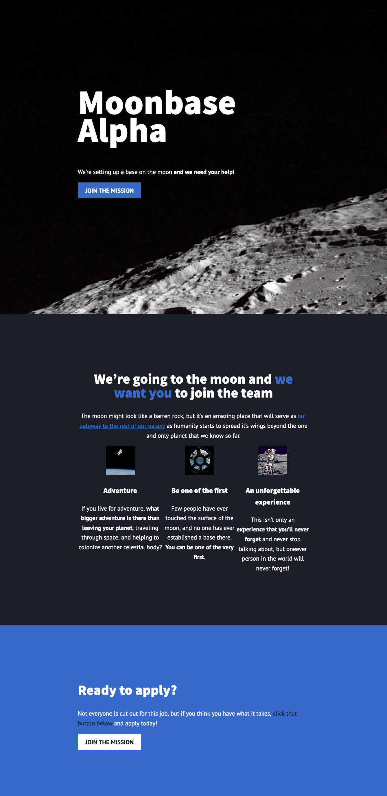
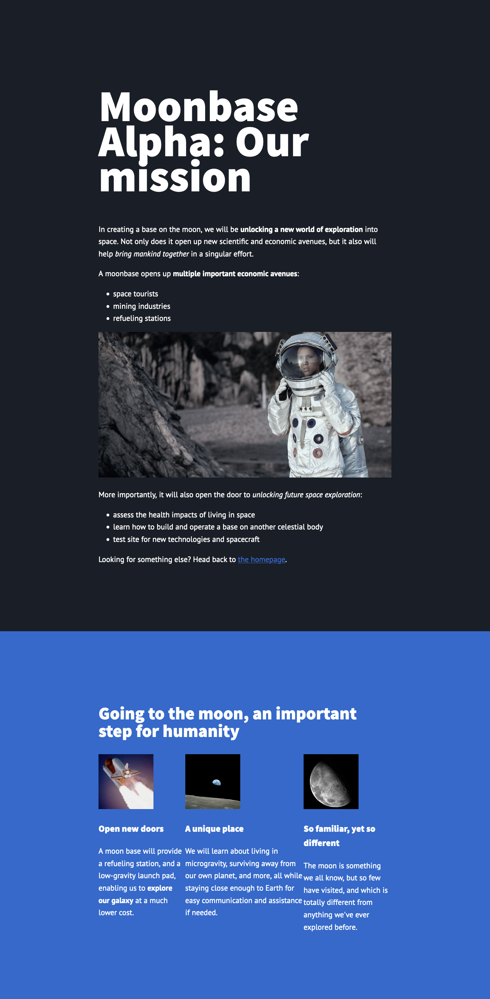

# Scrimba - Moon Base

This is a solution to the [Scrimba Frontedn Career Path - Module 1](https://scrimba.com/learn/frontend/why-learning-web-development-is-a-superpower-cPkK7mUE).

## Table of contents

- [Overview](#overview)
  - [The challenge](#the-challenge)
  - [Screenshots](#screenshot)
  - [Links](#links)
- [My process](#my-process)
  - [Built with](#built-with)
  - [What I learned](#what-i-learned)
  - [Continued development](#continued-development)
- [Author](#author)

## Overview

### The challenge

Users will be able to:

- Understand & Apply basic HTML consepts
- Understand & Apply basic CSS consepts

### Screenshots

### Links

- Solution URL: [GitHub](https://github.com/Rod-Barbosa)
- Live Site URL: [rodrigo-moonbase.netlify.app](https://rodrigo-moonbase.netlify.app/)

## My process

### Built with

- Semantic HTML5 markup
- CSS custom properties

### What I learned

Quick recap fo the basics

### Continued development

Just keep going. Scrimba looks awesome

## Author

- Website - [Rodrigo Barbosa](https://www.gelatodigital.com)
- Frontend Mentor - [@Rod-Barbosa](https://www.frontendmentor.io/profile/Rod-Barbosa)

